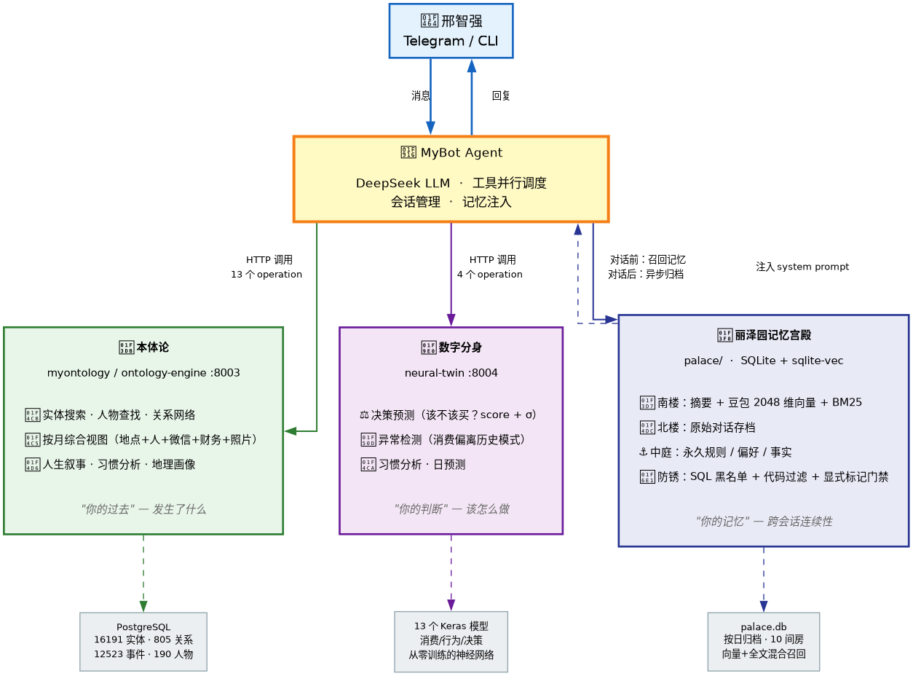

# MyBot

个人 AI Agent — 通过 Telegram / CLI 与你对话，连接本体论知识图谱、数字分身神经网络和丽泽园记忆宫殿。



## 核心能力

| 模块 | 作用 | 技术 |
|------|------|------|
| **本体论** | "你的过去" — 人物/关系/事件/按月综合视图 | HTTP → myontology/ontology-engine :8003 |
| **数字分身** | "你的判断" — 决策预测/异常检测/习惯分析 | HTTP → neural-twin :8004（13 个 Keras 模型） |
| **丽泽园记忆宫殿** | "你的记忆" — 跨会话连续性，防"记忆生锈" | SQLite + sqlite-vec + 豆包 2048 维向量 |

## 工具（8 个）

- **shell** — 白名单命令执行（ls/git/python/docker 等）
- **code** — 代码读写搜索
- **web_search** — DuckDuckGo 搜索
- **web_fetch** — 网页抓取转 Markdown
- **ontology** — 本体论查询（13 个操作）
- **neural_twin** — 数字分身调用（4 个操作）
- **calendar** — SQLite 提醒日历
- **memory** — 记忆存取（remember / recall / profile）

## 快速开始

### 1. 环境准备

```bash
git clone https://github.com/walkxing-glitch/mybot.git
cd mybot
python -m venv .venv
source .venv/bin/activate
pip install -e ".[dev]"
```

### 2. 配置

复制环境变量文件：

```bash
cp .env.example .env
```

编辑 `.env`，填入 API key：

```
DEEPSEEK_API_KEY=your_key_here
TELEGRAM_BOT_TOKEN=your_bot_token
DOUBAO_API_KEY=your_key_here        # 记忆宫殿向量嵌入
# 可选
ANTHROPIC_API_KEY=
OPENAI_API_KEY=
```

### 3. 运行

```bash
# CLI 模式
python -m mybot cli

# Telegram 模式
python -m mybot telegram

# 记忆宫殿管理
python -m mybot memory init      # 初始化 palace.db
python -m mybot memory stats     # 查看统计
python -m mybot memory list      # 列出记忆
python -m mybot memory review    # 审批待确认的长期记忆
```

### 4. macOS 常驻（可选）

```bash
# 创建 launchd plist
cat > ~/Library/LaunchAgents/com.mybot.plist << 'EOF'
<?xml version="1.0" encoding="UTF-8"?>
<!DOCTYPE plist PUBLIC "-//Apple//DTD PLIST 1.0//EN" "http://www.apple.com/DTDs/PropertyList-1.0.dtd">
<plist version="1.0">
<dict>
    <key>Label</key><string>com.mybot</string>
    <key>ProgramArguments</key>
    <array>
        <string>/path/to/mybot/.venv/bin/python</string>
        <string>-m</string><string>mybot</string><string>telegram</string>
    </array>
    <key>WorkingDirectory</key><string>/path/to/mybot</string>
    <key>RunAtLoad</key><true/>
    <key>KeepAlive</key><true/>
    <key>EnvironmentVariables</key>
    <dict><key>PYTHONUNBUFFERED</key><string>1</string></dict>
    <key>StandardErrorPath</key><string>/path/to/mybot/data/mybot.err.log</string>
</dict>
</plist>
EOF

launchctl load ~/Library/LaunchAgents/com.mybot.plist
```

## 架构

```
用户 (Telegram / CLI)
  → 网关层 (gateway/)
    → Agent 核心 (agent.py)
      → 对话前：丽泽园召回记忆 → 注入 system prompt
      → DeepSeek LLM 生成回复
      → 工具并行调度（最多 10 轮，60s 超时）
    ← 返回文本
  → 对话后：丽泽园异步归档
```

### 丽泽园记忆宫殿

防止"记忆生锈"（工具失败叙述被存为长期事实）的三道防线：

1. **SQL 黑名单触发器** — 含"不可用/服务中断/超时"等 8 个词的条目写入即拒
2. **代码层过滤** — Writer 双重检查
3. **显式标记门禁** — 中庭只接受用户明确说"记住/以后别"的内容

```
丽泽园
├── 北楼：原始对话存档
├── 南楼：摘要 + 2048 维向量 + BM25 全文索引
│   └── 10 间固定房间（消费/工作/人际/健康/学习/技术/项目/家庭/出行/情绪）
├── 中庭：永久规则 / 偏好 / 事实（需审批）
└── 防锈三道闸
```

## 配置文件

`config.yaml` 主要配置项：

```yaml
model:
  default: "deepseek/deepseek-chat"
  fallback: null

tools:
  enabled: [shell, code, web_search, web_fetch, ontology, neural_twin, calendar, memory]

palace:
  enabled: true
  embedder: doubao          # 豆包 API 向量嵌入
  embedder_dim: 2048
  top_k_south: 5            # 南楼召回数量
  top_k_fact: 3             # 中庭事实召回数量
```

## 外部依赖

MyBot 通过 HTTP 调用以下服务（各自独立部署）：

| 服务 | 端口 | 项目 |
|------|------|------|
| ontology-engine | :8003 | [myontology](https://github.com/walkxing-glitch/myontology-) |
| neural-twin | :8004 | neural-twin（Keras 数字分身） |
| 豆包 Embedding API | 远程 | ark.cn-beijing.volces.com |
| DeepSeek API | 远程 | LLM 推理 |

## 测试

```bash
# 全量 palace 测试
pytest tests/palace/ -m "not slow" -q

# 防锈回归测试
pytest tests/palace/test_no_rust.py -v
```

## License

MIT
